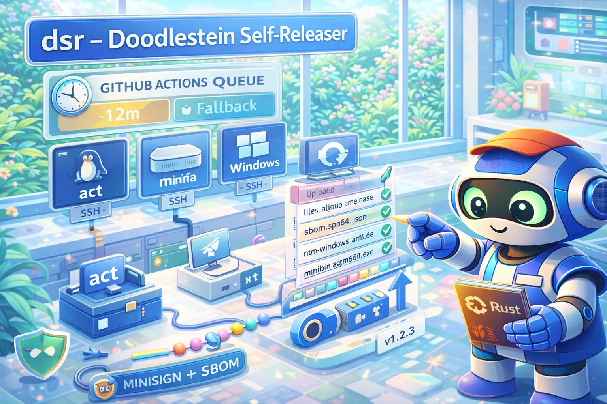

# dsr — Doodlestein Self-Releaser

<div align="center">
  
</div>

<div align="center">

**Fallback release infrastructure for when GitHub Actions is throttled.**

[](./LICENSE)
[](https://www.gnu.org/software/bash/)

</div>

<div align="center">
<h3>Quick Install</h3>

```bash
curl -fsSL "https://raw.githubusercontent.com/Dicklesworthstone/doodlestein_self_releaser/main/install.sh?$(date +%s)" | bash
```

</div>

When GitHub Actions queue times exceed 10 minutes, `dsr` takes over — reusing your existing workflow YAML to build locally via [nektos/act](https://github.com/nektos/act), then uploads artifacts to GitHub Releases.

---

## TL;DR

**The Problem**: GitHub Actions gets throttled during peak times. Your release sits in queue for 20+ minutes while users wait.

**The Solution**: `dsr` detects throttling, builds locally using your existing workflow files, and uploads to GitHub Releases — same artifacts, no queue.

### Why Use dsr?

| Feature | What It Does |
|---------|--------------|
| **Zero config builds** | Reuses your `.github/workflows/release.yml` — no parallel build system to maintain |
| **Multi-platform** | Builds on Linux (act), macOS (native), Windows (native) via SSH |
| **Signed releases** | Minisign signatures + SBOM generation built in |
| **Queue detection** | Monitors GH Actions queue time, triggers fallback automatically |

---

## Quick Example

```bash
# Check if any repos are throttled
$ dsr check --all
Checking ntm... queued 12m (threshold: 10m) ⚠️
Checking bv... ok ✓
Checking cass... ok ✓

# Build locally when throttled
$ dsr build --repo ntm --version v1.2.3
Building ntm v1.2.3 for linux/amd64, darwin/arm64, windows/amd64...
  linux/amd64   [act on trj]     ✓ 45s
  darwin/arm64  [native on mmini] ✓ 32s
  windows/amd64 [native on wlap]  ✓ 51s
Artifacts: /tmp/dsr/artifacts/ntm-v1.2.3/

# Upload to GitHub Release
$ dsr release --repo ntm --version v1.2.3
Uploading 6 assets to ntm v1.2.3...
  ntm-linux-amd64           ✓
  ntm-linux-amd64.minisig   ✓
  ntm-darwin-arm64          ✓
  ntm-darwin-arm64.minisig  ✓
  ntm-windows-amd64.exe     ✓
  ntm-windows-amd64.exe.minisig ✓
Release: https://github.com/Dicklesworthstone/ntm/releases/tag/v1.2.3

# Or do it all in one command
$ dsr fallback --repo ntm --version v1.2.3
```

---

## Design Philosophy

1. **Reuse, don't reinvent** — Your GitHub Actions workflow is the source of truth. `dsr` runs it locally via `act`, not a parallel build system.

2. **Detect, don't guess** — Queue time monitoring tells you exactly when to fall back. No manual threshold tuning.

3. **Same artifacts, different path** — Users get identical binaries whether built by GH Actions or `dsr`.

4. **Fail loudly, recover gracefully** — Structured exit codes (0-8) and JSON output for scripting. Partial failures are reported, not hidden.

5. **Local-first, cloud-optional** — Works offline. SSH to your Mac Mini and Windows laptop for native builds.

---

## Comparison

| Feature | dsr | Manual builds | GoReleaser | GitHub-hosted runners |
|---------|-----|---------------|------------|----------------------|
| Uses existing workflow | ✅ | ❌ | ❌ Config needed | ✅ |
| Multi-platform builds | ✅ Linux/macOS/Windows | Manual | ✅ | ✅ |
| Queue detection | ✅ Automatic | ❌ | ❌ | N/A |
| Signing | ✅ Minisign | Manual | ✅ GPG/cosign | ✅ |
| SBOM generation | ✅ syft | Manual | ✅ | ✅ |
| Cost | Free | Free | Free | $$/min |

**When to use dsr:**
- You have existing GH Actions release workflows
- You want a fallback for throttled queues
- You have SSH access to macOS/Windows machines for native builds

**When dsr might not be ideal:**
- You don't use GitHub Actions
- You need builds on platforms you don't have machines for
- You want a full CI/CD replacement (dsr is a fallback, not a replacement)

---

## Installation

### From Source

```bash
git clone https://github.com/Dicklesworthstone/doodlestein_self_releaser.git
cd doodlestein_self_releaser
chmod +x dsr
sudo ln -s "$(pwd)/dsr" /usr/local/bin/dsr
```

### Dependencies

Required:
- **Bash 4.0+** (macOS ships with 3.x — `brew install bash`)
- **git** — Version control
- **gh** — GitHub CLI for API access
- **jq** — JSON parsing

For local builds:
- **docker** — Required for nektos/act containers
- **act** — `brew install act` or [nektos/act releases](https://github.com/nektos/act/releases)

> **CRITICAL: act Configuration Required**
>
> The default act runner images (catthehacker/ubuntu) run as UID 1001. If you use `--bind` in your `~/.actrc` without proper user mapping, **files created by act will have wrong ownership**, breaking access for other processes.
>
> After installing act, copy the example config:
> ```bash
> cp config/actrc.example ~/.actrc
> ```
>
> Or add this line to your `~/.actrc` (replace 1000:1000 with your UID:GID from `id`):
> ```
> --container-options --user=1000:1000
> ```
>
> Run `dsr doctor` to verify your configuration.
>
> See [docs/ACT_SETUP.md](docs/ACT_SETUP.md) for complete setup instructions.

For multi-platform builds:
- **ssh** — Access to macOS/Windows build machines

For signing:
- **minisign** — `brew install minisign`
- **syft** — For SBOM generation

### Verify Installation

```bash
dsr doctor
```

---

## Quick Start

### 1. Initialize Configuration

```bash
dsr config init
```

This creates `~/.config/dsr/config.yaml` with defaults.

### 2. Add Repositories

```bash
dsr repos add Dicklesworthstone/ntm --local-path /data/projects/ntm --language go
```

### 3. Configure Build Hosts (Optional)

Edit `~/.config/dsr/hosts.yaml`:

```yaml
hosts:
  trj:
    platform: linux/amd64
    connection: local
  mmini:
    platform: darwin/arm64
    connection: ssh
    ssh_host: mmini
  ts1:
    platform: linux/amd64
    connection: ssh
    ssh_host: ts1
    build_root: /var/tmp/dsr-builds   # optional: disk-backed staging root
  wlap:
    platform: windows/amd64
    connection: ssh
    ssh_host: wlap
```

Ensure hosts have required toolchains for your repos (rust/go/bun) and that `trj` has Docker + act for Linux builds.

Release snapshots and isolated Rust builds are staged under `/var/tmp` on Linux hosts and
`/private/tmp` on macOS — never `/tmp`, which is frequently a RAM-backed tmpfs that a multi-GB
source tree plus Cargo target will exhaust. Set `build_root` on a host to stage somewhere else
(a bigger disk, or a host whose `/var/tmp` is also RAM-backed); `DSR_STRICT_BUILD_ROOT` still
overrides it for strict release snapshots. Either way dsr refuses to stage onto a tmpfs/ramfs
root and tells you to set `build_root`.

Strict snapshots must also live on a filesystem that preserves POSIX file modes. ExFAT, FAT
and some FUSE/SMB mounts report every file as executable, so a tracked `100644` file can no
longer be distinguished from a `100755` one. dsr verifies each extracted snapshot (bytes,
modes, links and the exact node count) immediately after transfer, before any target compiles,
and names the first offending path, its Git mode, the observed mode and the backing filesystem.
On a Mac whose only large disk is an external ExFAT drive, create an APFS disk image on it
(`hdiutil create -size 200g -fs APFS -volname dsr-builds /Volumes/External/dsr-builds.sparseimage
-type SPARSE`), attach it, and point `build_root` at the mounted volume.

Set `DSR_KEEP_BUILD_STAGES=1` to retain isolated Rust source and Cargo-home staging
directories after a native build, including failed or cancelled builds. This is
useful for inspecting a build or when automatic deletion is prohibited. Retained
stages consume disk space; the build log records their paths. Source isolation,
artifact collection, and verification run normally.

Strict native Unix Rust builds seed private Cargo homes with downloads selected
by the committed `Cargo.lock`: checksum-matching crate archives, their index
records, and Git databases containing locked commits. Ambient extracted registry
sources and Git checkouts are never copied; Cargo recreates them offline from
the selected downloads. Unrelated cached links, special files, and large archives
do not enter the seed, and an unused Git cache on another volume is not opened.
Selection covers the complete lockfile, including other targets and features;
selected Git databases retain their history. It is not a minimal target graph.
Strict Windows builds copy the ambient `registry` and `git` caches into private
files before Cargo runs. Strict Unix hosts require Python
3.11+; strict Windows hosts require PowerShell 7.4+ and a local NTFS Cargo cache. Configuration,
credentials, symlinks, Windows reparse points, and external Git storage
pointers are excluded or refused. The first successful locked, offline metadata
resolution publishes a retained seed alongside the source snapshot. If that
first resolution lacks dependencies, no seed is published: refill the ambient
cache and retry. Once admitted, the seed survives deletion or in-place changes
to the ambient cache, and every metadata invocation and target attempt receives
a fresh copy. Unix retained seeds contain downloads only, even after metadata
has unpacked sources, and retries must match the seed's original lockfile
selection. Parallel targets therefore do not share writable dependency files.

Before a strict native seed is admitted, DSR authenticates the resolved
dependency source files against the committed `Cargo.lock`. Registry archives
must have their locked SHA-256 checksums, and their extracted files must match
those archives. Git checkouts must match the locked commit's actual objects.
This covers the all-features graph from every workspace member on both Unix
and Windows. Vendored sources have a separate trust basis: they must be inside
the primary workspace's independently verified source snapshot.
The coordinator holds hashes of metadata and source evidence, verifies them
before compilation, and independently rechecks the source files before artifact
collection. Editing a cached dependency, metadata, or a remote receipt refuses
publication even when Cargo successfully compiles it. The compact evidence is
retained as `cargo_isolation.dependency_sources`; full source inventories stay
in each attempt's private Cargo home. Windows uses native handles and the .NET
archive reader without extracting another untrusted archive, rejects ambiguous
Windows paths and case collisions, and accepts Cargo-generated lockfile versions
3 and 4, including unused patch records without treating them as resolved pins.

Strict Windows Rust builds also use one Cargo command context for metadata and
compilation. A literal `cargo +nightly build --release`, for example, resolves
its dependencies with the selected nightly Cargo instead of the host's default.
Both operations use the system CMD launcher with the same working directory,
configured environment, compiler/SDK cleanup, and native-build RCH bypass.
The admitted context is checked before and after compilation; changes to the
command, relevant environment, Cargo configuration, or toolchain selection files
prevent artifact collection. Results retain its digests under
`cargo_isolation.cargo_context` without storing environment values in that receipt.

This Windows boundary accepts one literal `cargo build` or `cargo rustc` command,
an optional first `+toolchain`, and ordinary Cargo build options. Quote whole
arguments containing spaces, such as `--features "feature_a feature_b"`.
Shell chains, variable expansion, redirection, quote concatenation,
`--config`/`-C`/`-Z`, alternate manifests, and compiler argument tails after `--`
are refused before dependency admission. Metadata intentionally retains the
locked, offline, all-features source-closure policy; it does not claim an exact
feature graph match. Windows executable and linker identity attestation remains
separate from this command-context guarantee.

Resume verifies the retained seed inventory before copying it. Changes to seed
bytes or unsafe cache entries are refused; a legacy snapshot whose cache roots
are symlinks or Windows junctions requires a new strict run. Cargo may legitimately unpack archives
or reconstruct Git checkouts in an attempt's private home. After a successful
build, DSR checks that the attempt's seed receipt has its original digest and
records the final inventory before collecting artifacts. Configuration, special
files, symlinks, and hardlinks with owners outside the private cache trees block
collection; hardlinks entirely within those trees are permitted. Build results
record `cargo_isolation.dependency_cache.seed` and `.final`, with
`cargo_isolation.cache_reuse: []`; failed targets retain their seed evidence
without a final inventory. These are retained local integrity records;
they do not protect against a build host rewriting all its evidence.

The copies include the complete selected cache trees and remain alongside the
strict snapshot, so allow disk space for the retained seed and each metadata or
target attempt.

Ordinary (non-strict) native Rust builds get the same protection. Each
target's fresh stage root receives a private copy of the ambient `registry` and
`git` caches (`${CARGO_HOME:-~/.cargo}`) before its build command starts, never
the ambient configuration or credentials, so pruning or rewriting the host's
Cargo cache cannot break a running build. Cargo may still download missing
dependencies into the private home. After a successful build the private
home's final inventory is checked like a strict one; configuration, links or
special files added there refuse artifact collection. The result records
`cargo_isolation.dependency_cache.seed`/`.final` with `cache_reuse: []`. This
requires Python 3.9+ on Unix or PowerShell 7 on Windows, and the copy is removed
with the stage root unless `DSR_KEEP_BUILD_STAGES=1`. Windows uses native file
handles to refuse reparse points, concurrent file writes during copying and
external hardlinks in private caches. The same seed/final inventory fields are
retained for both host platforms; Windows receipt paths use `C:/...` form.
The cargo-xwin backend already uses private dependency copies separately.

Strict native Unix Rust builds can opt into a host-local intermediate cache with
`strict_cargo_cache_root: /absolute/private/cache` in the repository build config.
The operator must create that canonical directory owned by the build user with
mode 0700; symlink and writable ancestor paths are refused. This requires Python
3.11+ and nightly Cargo/rustc with `build.build-dir` and checksum-freshness
support. Stable toolchains and graphs containing any build script are refused:
Cargo still uses timestamps for `rerun-if-changed` inputs even in checksum mode.
Admission uses frozen, offline dependency metadata and requires an existing
lockfile and locally available dependencies. Windows and ordinary builds reject
this option. No active build configuration is changed automatically.
The configured recipe is trusted: every Cargo invocation must build the admitted
workspace and preserve DSR's forced freshness environment. Recipes that change
the Cargo workspace via `cd` or `--manifest-path`, or override freshness settings,
are unsupported. DSR does not parse arbitrary shell recipes to prove this rule.

DSR still builds the immutable source snapshot with an isolated Cargo home and a
fresh final target directory. A namespace includes the tool, target, configured
command, profile, compiler identities, build environment, and macOS SDK settings.
Cargo checks source/dependency contents across releases, including snapshots
whose changed files have equal or older timestamps. This option cannot currently
be enabled for projects with build scripts, including FrankenTerm. An exclusive lock
covers the complete build command and detachment of hard-linked final outputs;
contention fails explicitly. Artifact collection uses only the private run's
outputs, never the shared intermediates, and requires a successful build/cache
receipt. Existing source, family, signature, and test gates remain mandatory.
The cache is trusted build-host state, not independent source provenance. Retain
its directory between runs; DSR does not prune it. Benefit must be measured as
dependency reuse: final linking and test execution are not skipped.
The receipt hashes resolved Cargo/rustc executables separately from launch
wrappers. SDK settings/Xcode identity and configured native tool hashes are
namespace inputs; this is not a recursive digest of SDK headers or the Rust
sysroot. Those installations must remain immutable during cache use; replace
the private cache root when modifying their bytes in place without changing
their recorded identities.
Unknown Cargo/rustc launcher scripts are refused even if their version output
matches. Explicit `RUSTC_WRAPPER` and `RUSTC_WORKSPACE_WRAPPER` are unsupported
with caching; omit the cache option for recipes requiring those wrappers.
The reviewed RCH shim v4/toolchain wrapper v3 bytes are accepted only with the
native bypass and without real-executable overrides; upgrades require review.
For default Apple C/C++ launchers, the receipt also hashes the actual clang
selected by `xcrun --find`, rather than treating `/usr/bin/cc` as that compiler.

Windows Rust source staging uses Robocopy with eight copy threads to avoid the
per-file PowerShell overhead on large dependency trees. It preserves empty
directories, file attributes, timestamps, and links without following link targets.
Copy failures, unexpected destination files, and mismatches stop the build;
the copy never purges files. Compiler concurrency and build time limits are unchanged.

### 4. Set Up Signing (Recommended)

```bash
dsr signing init
```

This generates a minisign key pair at
`~/.config/dsr/secrets/minisign.key` and `~/.config/dsr/minisign.pub`.
For a fail-closed strict release, commit the public key into the tool's own
repository and set `release_contract.minisign_public_key_file` to that safe
repository-relative path. DSR pins the key bytes to the release tag, requires
one `<primary>.minisig` per contracted primary, and verifies downloaded release
bytes before publication and during `dsr release verify`. The private key stays
outside the repository and may be selected with `DSR_MINISIGN_KEY`.

An exact release contract may include `SHA256SUMS`, `SHA256SUMS.txt`, or the
legacy `checksums.txt` in `exact_additional_assets`, together with each selected
aggregate's `.minisig` signature. All three names use the same sorted checksum
entries, derived from the manifest's primary and additional payloads after
native collection; they do not belong to an individual build target. DSR
verifies the downloaded aggregate and signature as well as every primary
signature. An existing aggregate must already match those exact bytes and
must be a regular file; retries refuse mismatched or linked aggregates.
List primary signatures only through `minisign_public_key_file`; they are
implicit assets and must not also appear in `exact_additional_assets`.

A strict release publishes its generated build manifest only when the contract
names it. `build_manifest_assets` lists one or two literal `.json` basenames;
the second is a byte-identical compatibility alias. This lets a tool whose
repository key differs from its binary keep a historical manifest name:

```yaml
tool_name: eidetic_engine_cli
binary_name: ee
release_contract:
  checksum_sidecar: sha256
  exact_primary_assets: {linux/amd64: ee-x86_64-unknown-linux-gnu.tar.xz}
  build_manifest_assets: [ee-v0.17.0-manifest.json]
```

Each name is bound to the frozen manifest's own SHA-256 and size in the upload
plan (not by a self-referential manifest row), so no receipt is fabricated and
the generated JSON is never edited. DSR writes the copy into the artifact
directory without clobbering; an existing copy must already be an identical
regular file. The copies join the closed upload set and are verified on GitHub
with every other asset, including by `dsr release verify --fix`, which can
restore a missing copy. Names must not collide (case-insensitively) with any
other planned asset or a derived checksum aggregate.

Repositories that protect release tags can also pin
`release_contract.github_tag_ruleset.repository_id` and `ruleset_id`. DSR then
fails closed unless authenticated, no-cache GitHub reads prove that the exact
repository owns an active `refs/tags/v*` ruleset with both update and deletion
protection, no bypass actors, and an unambiguous current history version. It
freezes that source-bound receipt during strict preflight, refreshes it before
draft admission and immediately before publication, and reports the revalidated
receipt from `dsr release verify`. Missing or redacted policy fields are not
treated as evidence.

### 5. Check System Health

```bash
dsr doctor
```

### 6. Check Status Summary

```bash
dsr status
dsr status --refresh   # refresh host health checks
```

---

## Commands

### Global Flags

```bash
--json, -j           # Machine-readable JSON output
--non-interactive, -y # Disable prompts (CI mode)
--dry-run, -n        # Show planned actions without executing
--verbose, -v        # Verbose logging
--quiet, -q          # Suppress non-error output
--no-color           # Disable ANSI colors
```

**Stream separation:** human-readable output goes to stderr, structured JSON goes to stdout. For scripting, use `--json` and capture stdout (or redirect stderr to `/dev/null`).

### `dsr check`

Detect throttled GitHub Actions runs.

```bash
dsr check                           # Check all configured repos
dsr check --repos ntm,bv            # Check specific repos
dsr check --threshold 300           # Custom threshold (5 min)
dsr check --all                     # Check all workflows, not just releases
dsr check --json                    # JSON output for scripting
```

A configured tool's `workflow` is its release workflow; without `--all` only
that workflow's runs count. Queued and in-progress runs are queried separately
and paginated, so completed history cannot hide an older throttled release.
The default threshold is `threshold_seconds` from the config (or
`DSR_THRESHOLD`), else 600s. Exit 0 means no throttling, 1
throttling (`.details.throttled[]` names repo, tool, workflow, run and its
tag), and 8 an API or incomplete-listing error when no other repository is
throttled. Failed pages, invalid active-run timestamps, and GitHub's filtered
result limit cannot produce a healthy result; inspect `.details.skipped` for
the affected repository.

### `dsr build`

Build artifacts locally.

```bash
dsr build --repo ntm                            # Build all targets
dsr build --repo ntm --targets linux/amd64      # Specific target
dsr build --repo ntm --version v1.2.3           # Specific version
dsr build --repo ntm --parallel                  # Bounded concurrency (2 targets)
dsr build --repo ntm --parallel=4                # Explicit concurrency bound
dsr build --repo ntm --resume                    # Resume latest interrupted run
dsr build --repo ntm --resume=<run-id>           # Resume a specific run
```

Parallel builds keep attempt-scoped logs and results per target. A partial run
preserves verified completed artifacts; resume retries only incomplete targets.
The authoritative manifest is withheld until every requested target, artifact
collection, packaging, and completion-state write succeeds. Real builds mark
their output directory non-publishable before starting work and hold the build
lock through final publication. Failed or interrupted outputs remain blocked
by `release` and `release verify`, including when `--no-manifest` is requested.
Use `--resume` to retry packaging or finish interrupted publication from the
verified target receipts without rebuilding completed targets.

Keep the completed manifest with its artifact directory: the publication
receipt binds its exact bytes, run ID, and source commit. Removing or modifying
the manifest invalidates that receipt. Dry runs and `--sync-only` leave the
existing publication state untouched.

Ordinary builds retain each host's source-sync result and build from the path
that was successfully synced. Rsync compares file contents so equal sizes and
timestamps cannot hide source edits. If a transfer fails, that host's unfinished
native targets fail at the `source_sync` stage before acquiring a build slot
or launching a compiler. Other synced hosts can continue. Repair the connection
and use `--resume` to sync again and retry the blocked targets; verified
completed artifacts remain reusable, and sync failures do not consume compiler
retries. `--sync-only` exits 1 if any host fails. Use `--no-sync` when you manage
the remote sources separately; it explicitly bypasses the sync gate on resume.

Normal native builds stage source in fresh directories under the host's
configured `build_root`, or its default disk staging location. Each stage
receives the controller's Git HEAD, branch, and tags through a verified bundle,
so Git-based build scripts work on first-time hosts and linked worktrees.
Dirty and untracked files included by ordinary sync retain their contents.
The private Git repository preserves the controller's `core.autocrlf` and
`core.eol` settings so line-ending normalization does not create false dirty
version stamps. Existing host checkout metadata, other Git configuration,
hooks, and credentials are not copied into the build repository. Git-backed
sibling crates receive their own contexts, and a missing required sibling
blocks sync.

The source must be a complete, non-shallow SHA-1 repository worktree at its
top-level directory. Sparse checkouts and files marked `assume-unchanged` or
`skip-worktree` are refused because their dirty-state semantics cannot be
reconstructed from the transferred files. Source directories and bundle
receipts remain available for resume. `--sync-only` continues to synchronize
the configured checkout paths; `--no-sync` uses externally managed sources.

A failed strict native target can move to another configured host during an
explicit resume, after the original controller has released its build lock:

```bash
dsr build ntm --version v1.2.3 --resume=<run-id> \
  --resume-target-host windows/amd64=windows-backup \
  --resume-target-host-approval /path/to/reviewed-relocation.json
```

The approval pins the prior and replacement configuration hashes; its fields
are specified in [CLI_CONTRACT.md](docs/CLI_CONTRACT.md). Only that failed
target's host, command, or environment may change. Completed target settings,
artifacts, and old attempt receipts are retained. DSR verifies the same frozen
source and dependency archives on the replacement before updating run state.
A retry may reuse an already staged canonical snapshot only after full byte
verification; partial or mismatched staging is refused without overwriting it.

For native performance measurements of a tool with a strict release contract,
use an explicit diagnostic build:

```bash
dsr build frankenterm --version 0.15.6-rc.13 --diagnostic-native --target darwin/arm64
```

This builds only the requested native targets while retaining the clean tagged
source, pinned dependency, immutable host snapshot, and application family
checks. It requires explicit targets and writes to
`$DSR_STATE_DIR/diagnostics/<tool>-<tag>/<run-id>`; `--output-dir`, `--no-sync`,
and `--sync-only` are unavailable in this mode. Additional assets must have
exact target ownership in `workspace_additional_artifacts`.

Diagnostic run state, target receipts, and manifests record
`build_purpose: "diagnostic-native"` and `publishable: false`. Resume requires
the same purpose and source bindings. Release, release verification, and
release artifact reuse reject diagnostic outputs, even if the tool's strict
contract is subsequently removed. Strict release manifests require explicit
`build_purpose: "release"` and `publishable: true` on the manifest and its
artifacts; older unclassified strict manifests must be rebuilt. An ordinary
release build still requires the complete configured strict target set.
Diagnostic completion proves only the selected build, not release readiness
or a performance improvement.

For Rust workspaces that ship more than one executable, list each name under
`workspace_binaries`. DSR packages them together and also includes every
regular companion file named by `include_files`; every path component must be
free of symlinks. Unsafe paths, missing files, and collisions with a binary fail
the target instead of silently producing an incomplete release archive.

Ordinary (non-strict) builds apply the same rule to archives a build lane
already produced: an act or prebuilt archive in the configured format is
checked for its `include_files` members rather than trusted because the
format matches. If it lacks some of them, DSR rebuilds it from its own payload
plus the missing companions, refreshes the manifest digest, and updates a
compat alias that was a byte copy of it. When a lane `.sha256`, `.minisig` or
`SHA256SUMS` entry already attests the thin bytes, the build ends `partial`
(exit 1) naming the archive rather than ship a stale attestation or an
incomplete archive. `flat_archive: true` opts out as before.

Use `workspace_binaries_by_target` when executable families differ by platform.
Each target entry replaces the complete `workspace_binaries` list for that
target, including collection and archive verification. For example:

```yaml
workspace_binaries: [ft, frankenterm-mux-server, frankenterm-pty-guardian]
workspace_binaries_by_target:
  windows/amd64: [ft, frankenterm-mux-server, frankenterm-pty-guardian, frankenterm-gui]
```

Unlisted targets retain the default list. Invalid lists and colliding Windows
executable names fail before collection; native binaries do not belong in
`workspace_archive_files`, which is reserved for companion files.

### `dsr release`

Upload artifacts to GitHub Release.

```bash
dsr release --repo ntm --version v1.2.3         # Upload to release
dsr release --repo ntm --version v1.2.3 --draft # Create draft release
dsr release --repo ntm --version v1.2.3 --dispatch # Trigger repository dispatch hooks
dsr --dry-run release --repo ntm --version v1.2.3   # Show the exact upload plan, change nothing
```

The dry-run plan lists every name each artifact will be published under (its
manifest name, versioned name, installer-compatible name and `x86_64`/`aarch64`
aliases), the build manifest, the generated `SHA256SUMS` and per-name `.sha256`
sidecars, and existing signatures/SBOMs; with `--json` the same plan is in
`details.plan`. It uses the same naming code as the real upload.

A release publishes what the build manifest lists, and only from the commit the
version's tag names. `dsr build` writes no manifest after a partial build, so
`release` refuses a directory without one (pass `--no-manifest` to upload a
hand-assembled directory as-is). It also refuses artifacts built from a
different commit than the local tag, and a tag that origin holds at another
commit. A tag not yet on GitHub is created at the tagged commit. `dsr build
--version X` stops before building when tag X exists and the checkout is
elsewhere.

Both the dry-run and the real release check the project's own curl|bash
installer (`install_script_path`, else `install.sh` in the checkout): for each
non-Windows target dsr computes the asset name the installer downloads,
including an archive extension the script hardcodes, and confirms the release
publishes it. A miss is reported as a warning with the missing name (and in
`details.installer_check`), never as a release failure, so you learn about a
broken `curl | bash` before your users do. Fix `install.sh` or set
`install_script_compat`, then run `dsr repos validate`.

For repositories whose existing release venue contains source only, use an
explicit `repos.d/<tool>.yaml` configuration with these four fields:

```yaml
tool_name: example
repo: owner/example
local_path: /absolute/path/to/example
publication_mode: source-only
```

```bash
dsr release source-only example 1.2.3 --notes-file release-notes.md --no-dispatch
dsr release source-only example --tag example-v1.2.3 --notes-file release-notes.md --no-dispatch
```

This mode requires a clean checkout whose HEAD and local tag match the remote
tag. It creates and verifies its own draft before publishing, verifies an empty
asset inventory, and retains a separate publication receipt. Existing releases,
legacy registry entries for the same tool, and build configuration are refused.
Use `--draft` to retain the verified draft, or global `--dry-run` to inspect the
admission result without creating a release. Source-only configuration cannot
be used by the normal binary publication command.

Use exactly one positional version or `--tag`. The explicit tag form preserves
the exact crate or workspace tag; it accepts only a single Git ref component
starting with a letter or digit, using letters, digits, `.`, `_`, `+`, or `-`.
Both forms require the same clean checkout and local/remote peeled tag identity.

If GitHub temporarily omits a newly created draft from its release list, DSR
retains the private pending receipt. Retry with the same inputs and
`--resume-receipt /absolute/path/to/the/receipt`. Recovery verifies the original
nonce-bound draft and creates no new release; it retains the original receipt
and records a separate recovery receipt. Ordinary `--resume` remains a binary
publication option and is refused in source-only mode.

If strict binary creation succeeded but its controller stopped before
publication, preserve the original private `dsr-api-response.*` POST response.
Recovery requires a response that actually survived or was preserved; it cannot
reconstruct creation custody from public release metadata.
Use `dsr release verify TOOL VERSION --fix` to repair missing draft assets
(add `--dry-run` to list the uploads without performing them). Once
all signed assets verify, finalize through DSR:

```bash
dsr release finalize TOOL VERSION --create-response /private/scratch/dsr-api-response.ABCDEF12 --no-dispatch
```

The response must remain a single-link, owner-only regular file in the same
canonical private `TMPDIR` used by the GitHub adapter. Finalization verifies its
original creation nonce, release ID and metadata against the current exact
source and complete signed asset inventory. It freezes explicit configuration
and registry inputs, writes private recovery evidence before publishing, and
rechecks all evidence afterward. It never creates or uploads assets, accepts a
tag lookup as custody, or dispatches workflows. Inventories of 100 or more
assets are refused. Global dry-run performs verification without publication.
Recovery requires Python 3 for bounded, no-follow descriptor validation of the
private receipt and its directory; device, inode, and byte identity remain
fixed through publication.

### `dsr installer`

Generate the `curl | bash` installer for a tool from its `repos.d/<tool>.yaml`:

```bash
dsr installer generate ntm                 # writes installers/ntm/install.sh
dsr installer generate --all --dry-run     # list what would be generated
dsr installer validate ntm                 # syntax, ShellCheck, safety checks
```

The default output directory (`installers/` beside dsr, or
`DSR_INSTALLER_DIR`, or `--output-dir`) is the one `dsr canary` tests. Commit
each generated `install.sh` to its tool's repository. Regenerate after
changing a tool's naming, targets, workspace executables, or signing key,
since these are embedded at generation (see "Installers and Verification").

The installer accepts the build's scalar `archive_format: tar.xz` or a mapping
such as `archive_format: {linux: tar.xz, darwin: tar.gz, windows: zip}`. Omitted
OS entries keep their defaults (tar.gz on Unix, zip on Windows). A `binary`
format selects a raw executable with no Unix asset suffix or `.exe` on Windows.
Configured formats require yq and jq during generation; unsupported formats
fail before replacing an existing installer.

For a workspace release, the installer installs the complete configured
executable set into the selected `--dir`:

```yaml
binary_name: tool
workspace_binaries: [tool, tool-daemon, tool-worker]
workspace_binaries_by_target:
  windows/amd64: [tool]
```

A target override replaces the global list. An empty list (`[]`) selects
only `binary_name`; every nonempty list must include that primary executable.
Before replacing any executable, the installer requires exactly one nonempty
archive member for each selected name and stages the complete set. A failed
replacement restores the previous executables and leaves unrelated files
alone. Successful `--json` output includes each installed executable's name,
path, SHA-256 and byte size in `binaries`, alongside the primary `path`.

Rust source fallback builds the same selected set from one pinned commit,
including binaries in other workspace packages, and rejects ambiguous Cargo
output providers. Source installation still requires `--from-source` or
`--allow-source-build`; Go and Bun source builds support a single executable.

### `dsr canary`

Run a repository's installer in a clean Linux container, then require its
installed executable's `--version` and `--help` probes to succeed:

```bash
dsr canary run ntm --os ubuntu:24.04 --mode safe
```

The repository key and installed executable may differ. `binary_name` selects
the executable to probe. Generated DSR installers receive `--mode <mode>
--non-interactive` by default; an owned installer can declare its exact argv in
`repos.d/<tool>.yaml` (including an empty array):

```yaml
tool_name: frankenterm
binary_name: ft
canary_installer_args: []
canary_packages: [python3, minisign]
```

Installer failure, a missing configured executable, or a failed probe makes the
canary fail; none of those conditions are informational successes.

### `dsr fallback`

Full pipeline: check → build → release.

```bash
dsr fallback --repo ntm --version v1.2.3        # One command does it all
```

### `dsr watch`

Continuous monitoring daemon.

```bash
dsr watch                                       # Default: check every 60s
dsr watch --interval 30 --auto-fallback         # Auto-trigger on throttle
dsr watch --notify desktop                      # Desktop notifications
```

Without `--auto-fallback` the watcher only reports (and notifies) each
throttled release run once. With it, each run starts one `dsr fallback` for
the repo's configured tool at the run's version tag; repos with no dsr tool
are reported, never guessed. `dsr --dry-run watch --auto-fallback` shows which
fallbacks would start.

`--notify` takes a comma-separated list of `terminal`, `slack`, `discord`,
`desktop`, `agent_mail` (or `all`/`none`). Fallbacks started by the watcher
report their outcome through the same channels. Slack and Discord webhooks come
from `DSR_SLACK_WEBHOOK` / `DSR_DISCORD_WEBHOOK`, or from config.yaml:

```yaml
notifications:
  slack_webhook: "https://hooks.slack.com/services/..."
  discord_webhook: "https://discord.com/api/webhooks/..."
```

### `dsr repos`

Manage repository registry.

```bash
dsr repos list                                  # List registered repos
dsr repos add owner/repo --local-path /path     # Add a repo
dsr repos remove repo-name                      # Remove a repo
dsr repos validate                              # Validate all configs
```

### `dsr config`

Configuration management.

```bash
dsr config show                                 # Show current config
dsr config get threshold_seconds                # Get specific value
dsr config set threshold_seconds=300            # Set value
dsr config validate                             # Validate config files
```

### `dsr doctor`

System diagnostics.

```bash
dsr doctor                                      # Check all dependencies
dsr doctor --fix                                # Fix config/actrc; list the rest
```

### `dsr status`

System + last run summary.

```bash
dsr status                                      # Show cached summary
dsr status --refresh                            # Refresh host health checks
dsr status --compact                            # One line (prompts, tmux)
dsr status --watch                              # Redraw until interrupted
dsr status --json                               # JSON output
```

Exit 0 is healthy, 1 degraded (an unhealthy host, or the last command —
status/help/version/report aside — failed), 3 unhealthy (no configuration).
The summary includes the last command's outcome and the last `dsr check`
result.

### `dsr report`

Recent activity from the run logs every command writes.

```bash
dsr report                                      # Last 24h: runs, failures, throttling
dsr report --since 7d --limit 50                # A longer window
dsr report --repo ntm --json                    # One tool, machine-readable
```

Each run lists its command, tool, outcome and duration; failed runs (usage
errors and interrupts aside) also appear as alerts with their error codes.

### `dsr version`

Detect a repository's authoritative version and create an annotated release
tag. For Rust virtual workspaces, set `main_package` in the tool's
`repos.d/<tool>.yaml`; without it, all publishable workspace members must have
one common version. Ambiguous or unreadable workspaces fail closed and never
fall through to an unrelated ecosystem manifest. Workspace resolution is
read-only (`cargo metadata --locked --offline`), so it requires `cargo`, `jq`,
and a current `Cargo.lock`.

```bash
dsr version detect frankensqlite                 # Inspect version and tag state
dsr --json version detect /path/to/repo           # Machine-readable inspection
dsr --dry-run version tag frankensqlite           # Preview the exact tag
dsr version tag frankensqlite --push              # Create and push annotated tag
```

---

## Exit Codes

| Code | Name | Meaning |
|------|------|---------|
| `0` | SUCCESS | Operation completed successfully |
| `1` | PARTIAL_FAILURE | Some targets/repos failed |
| `2` | CONFLICT | Blocked by pending run/lock |
| `3` | DEPENDENCY_ERROR | Missing gh auth, docker, ssh, etc. |
| `4` | INVALID_ARGS | Bad CLI options or config |
| `5` | INTERRUPTED | User abort (Ctrl+C) or timeout |
| `6` | BUILD_FAILED | Build/compilation error |
| `7` | RELEASE_FAILED | Upload/signing failed |
| `8` | NETWORK_ERROR | Network connectivity issue |

---

## Configuration

### Main Config (`~/.config/dsr/config.yaml`)

```yaml
schema_version: "1.0.0"

# Queue time threshold before triggering fallback (seconds)
threshold_seconds: 600

# Default build targets
default_targets:
  - linux/amd64
  - darwin/arm64
  - windows/amd64

# Artifact signing
signing:
  enabled: true
  key_path: ~/.config/dsr/secrets/minisign.key

# SBOM generation
sbom:
  enabled: true
  format: spdx-json

# Logging
log_level: info  # debug|info|warn|error
```

### Repository Config (`~/.config/dsr/repos.d/ntm.yaml`)

```yaml
repo: Dicklesworthstone/ntm
local_path: /data/projects/ntm
language: go

targets:
  - linux/amd64
  - darwin/arm64
  - windows/amd64

workflow: .github/workflows/release.yml

# Pin this repo's build host per platform (cross_compile.<platform>.host,
# if set, takes precedence; unlisted platforms use hosts.yaml)
hosts:
  linux/amd64: trj
  darwin/arm64: mmini
  windows/amd64: wlap
```

### Config precedence: `repos.yaml` vs `repos.d/`

Tool configuration lives in two places with distinct roles:

- **`repos.d/<tool>.yaml` is the build authority.** `dsr build` and
  `dsr release` read it exclusively for build-affecting keys (`local_path`,
  `targets`, `build_cmd`, `target_triples`, `cross_compile`, `host_paths`,
  `artifact_naming`, `archive_format`, `release_contract`, ...). The file must
  be named after its own `tool_name` — the runner loads
  `repos.d/<tool_name>.yaml` by filename.
- **`repos.yaml` is the registry.** `dsr repos list/info/check` and the
  quality gates (`checks:`) read it.
- **Any key present in both files must be identical.** `dsr repos validate`
  fails on divergence: mismatched values, build keys present only in
  `repos.yaml` (the runner would ignore them), `repos.d` files missing from
  the registry, and `repos.d` files whose name does not match their
  `tool_name`. A tool with no `repos.d` file validates with a warning — it is
  registry-only and cannot build.

### Build target derivation and the Linux glibc floor

For Rust tools the runner derives `CARGO_BUILD_TARGET` from
`target_triples.<platform>` (or the standard triple for the platform) whenever
the platform's `cross_compile` env does not set one, so every build is
explicit about its target and the artifact collector always looks where cargo
wrote. Collected binaries are validated against the requested platform's
executable format (ELF/Mach-O/PE + machine type) before packaging — a
wrong-architecture artifact fails the build instead of shipping. Build
commands can branch on `DSR_TARGET_OS` / `DSR_TARGET_ARCH` /
`DSR_TARGET_PLATFORM` / `DSR_TARGET_TRIPLE` without parsing paths. Opt out of
the derivation with `derive_cargo_build_target: false`.

Linux Rust builds targeting `*-linux-gnu` — ordinary and strict
release-contract builds alike — default to a **portable glibc floor of
2.28**: a `cargo` shim (staged with the isolated source, or beside a strict
snapshot so the snapshot stays byte-identical) routes `cargo build` through
`cargo zigbuild --target <triple>.<floor>` (cargo-zigbuild >= 0.23.0 and zig
must be on the build host), and the collected binary's versioned glibc
symbols are asserted against the floor; a binary above it fails the target.
Without this, natively built amd64 binaries inherit the build host's glibc
and stop starting on Debian 12 / Ubuntu 22.04 / RHEL 9-class systems the
moment the build fleet upgrades. Configure per tool with
`linux_glibc_floor: "2.28"` (or another `MAJOR.MINOR`), opt out with
`linux_glibc_floor: native`; the floor is skipped automatically for musl
triples, and dsr applies no shim for platforms whose env carries an operator
cross toolchain (`CARGO_TARGET_<T>_LINKER` / `CC_<t>`) or build commands that
already invoke `zigbuild`, `xwin`, or `cross` — but an explicitly configured
`linux_glibc_floor` is still enforced on those binaries.

### gnu and musl variants of one platform

A platform may list several target triples when a release ships, for example,
both a glibc and a static musl build of `linux/amd64`:

```yaml
artifact_naming: "${name}-${version}-${target_triple}"
install_script_compat: "${name}-${target_triple}"
target_triples:
  linux/amd64:
    - x86_64-unknown-linux-gnu    # primary
    - x86_64-unknown-linux-musl
linux_libc_fallback: none
```

The first entry is the primary variant. Native Rust builds compile every
configured GNU/musl variant as an independent task, with its own
`CARGO_BUILD_TARGET`, source stage, Cargo home, output directory and resume
receipt. A workflow artifact whose name identifies no variant is named as the
primary. A workflow run through act can also build both variants; `dsr build`
collects them under the platform, gives each variant it produced its own
installer-compatible alias and configured `include_files`, and names any
configured variant the build did not produce. `dsr release` publishes each
artifact only under its own variant's names (an artifact names its variant by
the full triple or by a separate `gnu`/`musl` word). When the naming pattern
cannot tell variants apart (no `${target_triple}`), a name several variants
derive goes to the artifact it already names, else to the primary variant,
and the release says so instead of failing on a same-name collision.
Manifests retain each artifact's `target_triple`, so packaging and release do
not infer a different variant later. Native results retain the selected triple
and its build environment, and generic raw executable names are qualified by
triple during collection; the archives still contain the configured executable
name. Contradictory full triples or
libc markers fail collection. This is declared naming metadata, not ABI proof.
Generated installers detect GNU or musl (including musl `ldd --version` output
on stderr with a nonzero status), and `--libc gnu|musl` selects an exact variant.
An unavailable or unknown libc fails. The default `linux_libc_fallback: none`
can be changed to `musl` to allow automatic GNU-to-musl fallback when the GNU
payload is unavailable; it never permits musl-to-GNU fallback, overrides an
explicit `--libc`, or retries after integrity failure. Each configured triple
gets an independent archive/checksum/signature cache, including offline use.
To install both variants, use target-qualified names: a nonprimary variant
cannot be downloaded through a shared alias owned by the primary.
A `release_contract` names one exact primary asset per target, so it admits a
single triple per platform; `dsr config validate` rejects empty, duplicate or
malformed lists. Native matrix expansion is for ordinary Rust GNU/musl builds.
Resume reuses each completed variant only when its recorded files still match,
and refuses a changed matrix configuration; a failed variant does not force
its successful sibling to compile again. All variants must succeed before the
build produces a publishable manifest.

With `--parallel`, two targets on one host whose build writes the same
in-tree file (for example `go build -o tool ./cmd/tool`) no longer overwrite
each other: the later target builds in a private copy of the source under
`/var/tmp` (or the host's `build_root`), which is removed after collection.
Where a private copy cannot help (strict snapshots, Windows hosts, outputs
outside the tree such as a shared absolute `GOBIN`), the colliding targets
run one after the other.

A target whose host is at its `concurrency` limit waits for a slot for up to
one build timeout (`DSR_BUILD_TIMEOUT`, default 3600s) instead of failing
after five minutes; set `DSR_SELECTOR_WAIT_TIMEOUT` to choose another bound.

---

## Logging and State

dsr stores run logs and build artifacts under XDG state/cache directories:

```
~/.local/state/dsr/
  logs/YYYY-MM-DD/run.log
  logs/YYYY-MM-DD/builds/*.log
  artifacts/
  manifests/

~/.cache/dsr/
  act/
  builds/
```

When a command fails, start with the latest `run.log`, then per-build logs under `logs/YYYY-MM-DD/builds/`.

---

## Architecture

```
┌─────────────────────────────────────────────────────────────────┐
│                        dsr CLI                                   │
│   check │ build │ release │ fallback │ watch │ doctor           │
└─────────────────────────────────────────────────────────────────┘
                            │
        ┌───────────────────┼───────────────────┐
        ▼                   ▼                   ▼
┌──────────────────┐ ┌──────────────────┐ ┌──────────────────┐
│ GitHub API       │ │ Build Dispatch   │ │ Release Upload   │
│ - Queue monitor  │ │ - act (Linux)    │ │ - gh release     │
│ - Workflow runs  │ │ - SSH (macOS)    │ │ - Checksums      │
│                  │ │ - SSH (Windows)  │ │ - Signatures     │
└──────────────────┘ └──────────────────┘ └──────────────────┘
                            │
        ┌───────────────────┼───────────────────┐
        ▼                   ▼                   ▼
┌──────────────────┐ ┌──────────────────┐ ┌──────────────────┐
│ trj (Linux)      │ │ mmini (macOS)    │ │ wlap (Windows)   │
│ - Docker + act   │ │ - Native build   │ │ - Native build   │
│ - x86_64         │ │ - arm64          │ │ - x86_64         │
└──────────────────┘ └──────────────────┘ └──────────────────┘
```

---

## Troubleshooting

### "gh: command not found"

```bash
# macOS
brew install gh

# Linux
sudo apt install gh  # Debian/Ubuntu
sudo dnf install gh  # Fedora

# Then authenticate
gh auth login
```

### "act: command not found"

```bash
brew install act
# or download from https://github.com/nektos/act/releases
```

### "Error: Bash 4.0+ required"

macOS ships with Bash 3.x. Install newer Bash:

```bash
brew install bash
# Add to shells
sudo bash -c 'echo /opt/homebrew/bin/bash >> /etc/shells'
# Change default (optional)
chsh -s /opt/homebrew/bin/bash
# Or run dsr explicitly
/opt/homebrew/bin/bash dsr check
```

### "SSH connection to mmini failed"

1. Verify SSH access: `ssh mmini echo ok`
2. Check Tailscale is running: `tailscale status`
3. Verify host is in `~/.config/dsr/hosts.yaml`

### "Docker is not running"

```bash
# Start Docker Desktop, or:
sudo systemctl start docker  # Linux
```

### Files owned by wrong user (UID 1001) after running act

This happens when `~/.actrc` has `--bind` but is missing the `--user` flag. The catthehacker runner images run as UID 1001 (user "runner"), so files they create get that ownership.

**Fix:**

```bash
# Add user mapping to actrc
echo '--container-options --user=$(id -u):$(id -g)' >> ~/.actrc

# Fix existing files
sudo chown -R $(id -un):$(id -gn) /path/to/affected/repo
```

**Prevention:**

```bash
# Copy the example config (already has the fix)
cp /path/to/dsr/config/actrc.example ~/.actrc

# Verify configuration
dsr doctor
```

See [docs/ACT_SETUP.md](docs/ACT_SETUP.md) for complete act setup instructions.

---

## Installers and Verification

Installers generated by dsr always verify SHA256 checksums, and verify minisign
signatures whenever a public key is embedded. Use `dsr signing init` to generate
signing keys. The generator embeds the first key it finds: `minisign_pubkey` in
`repos.d/<tool>.yaml`, the tool's `release_contract.minisign_public_key_file`,
`signing.minisign_pubkey` in config.yaml, then the `minisign.pub` written by
`dsr signing init`. It warns when there is none (that installer then skips
signature checks) and refuses a value that is not a minisign public key.
Installers take `--version 1.2.3` or `v1.2.3`, `--mode vibe|safe` (`safe`
installs only the verified release binary: no agent skills, no source builds),
and `--yes` to replace an existing binary. Without `--yes` they ask on the
terminal even under `curl | bash`. Strict release
contracts opt into fail-closed signatures with a tag-tracked
`release_contract.minisign_public_key_file`; DSR then derives the exact
`.minisig` inventory and cryptographically verifies the served primary and
signature bytes, rather than relying only on GitHub asset metadata.
When `release_contract.github_tag_ruleset` pins numeric repository and ruleset
IDs, strict release and verification also require a live source-bound GitHub
receipt for immutable `refs/tags/v*` governance. A changed history version,
weakened rule, bypass actor, repository mismatch, or redacted field invalidates
the frozen receipt and blocks publication or verification.

---

## Further Reading

- `docs/CLI_CONTRACT.md` — authoritative CLI spec, JSON envelope, and exit codes
- `docs/ACT_SETUP.md` — nektos/act installation and setup guidance

---

## Limitations

### What dsr Doesn't Do

- **Not a CI/CD replacement** — It's a fallback for when GH Actions is slow, not a complete build system
- **No hosted runners** — You need your own machines for macOS/Windows builds
- **Caching is opt-in** — Strict Unix Rust builds may reuse intermediates as
  described above; other builds start fresh (act has some layer caching).

### Known Limitations

| Capability | Current State | Notes |
|------------|---------------|-------|
| Linux builds | ✅ Full support | Via act in Docker |
| macOS builds | ✅ Full support | Requires SSH access to Mac |
| Windows builds | ✅ Full support | Requires SSH access to Windows |
| ARM Linux | ⚠️ Experimental | QEMU emulation via act |
| Container caching | ⚠️ Basic | Docker layer cache only |

---

## FAQ

### Why "Doodlestein Self-Releaser"?

It's part of the Dicklesworthstone tool ecosystem. The name is intentionally whimsical.

### Does it work with private repos?

Yes, as long as `gh` is authenticated with access to the repo.

### Can I use it without nektos/act?

Yes, for macOS and Windows targets that build natively via SSH. Linux builds currently require act.

### How does it compare to self-hosted runners?

Self-hosted runners require always-on infrastructure. `dsr` uses your existing machines on-demand when GH Actions is slow.

### Can I use it in CI?

Yes. Use `--json --non-interactive` for scripted usage:

```bash
if dsr check --json | jq -e '.details.throttled | length > 0'; then
  dsr fallback --repo $REPO --non-interactive
fi
```

---

## About Contributions

Please don't take this the wrong way, but I do not accept outside contributions for any of my projects. I simply don't have the mental bandwidth to review anything, and it's my name on the thing, so I'm responsible for any problems it causes; thus, the risk-reward is highly asymmetric from my perspective. I'd also have to worry about other "stakeholders," which seems unwise for tools I mostly make for myself for free. Feel free to submit issues, and even PRs if you want to illustrate a proposed fix, but know I won't merge them directly. Instead, I'll have Claude or Codex review submissions via `gh` and independently decide whether and how to address them. Bug reports in particular are welcome. Sorry if this offends, but I want to avoid wasted time and hurt feelings. I understand this isn't in sync with the prevailing open-source ethos that seeks community contributions, but it's the only way I can move at this velocity and keep my sanity.

---

## License

MIT License (with OpenAI/Anthropic Rider). See [LICENSE](LICENSE).
